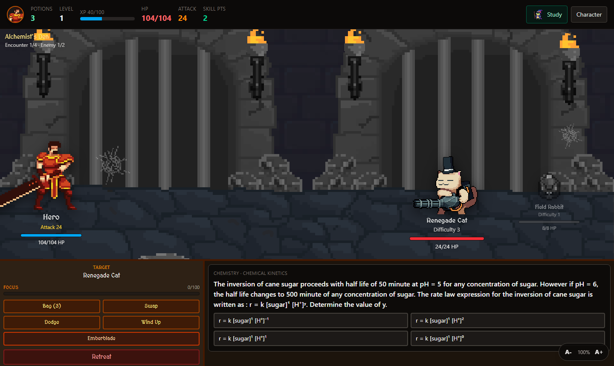
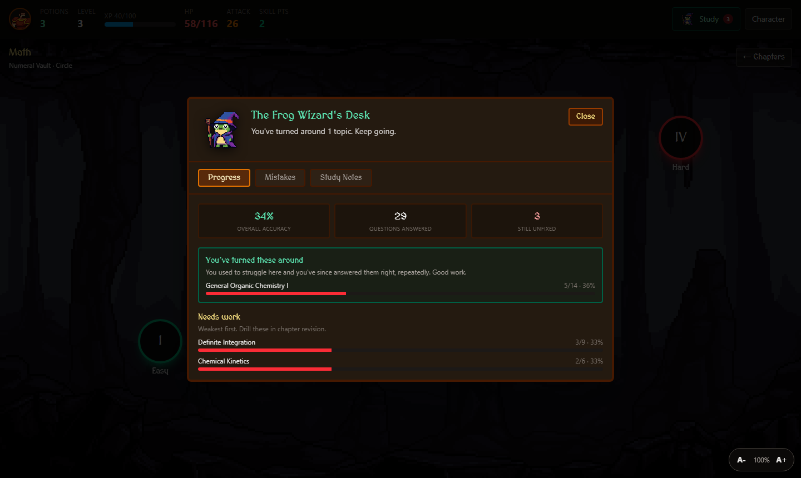
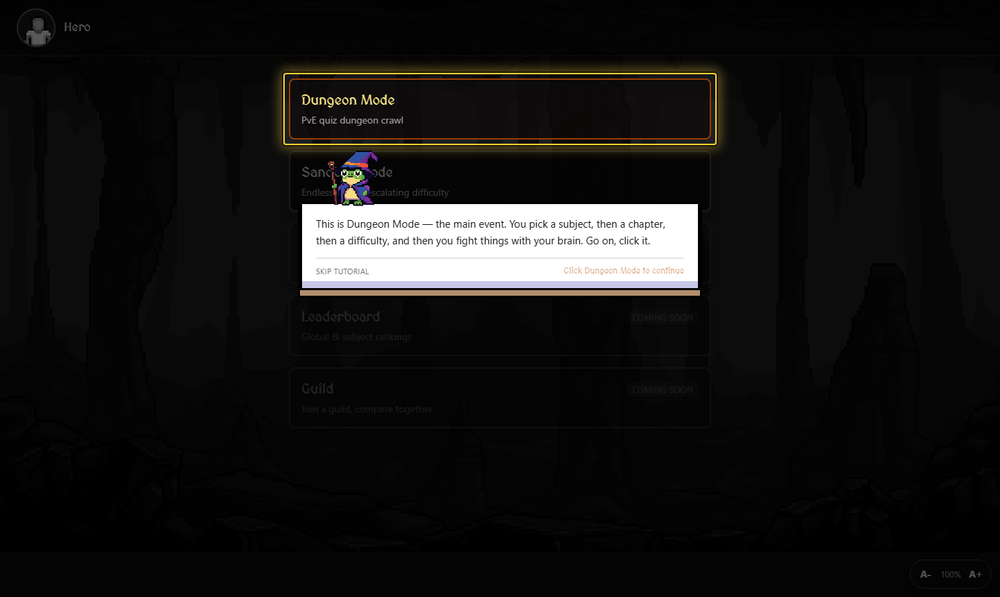
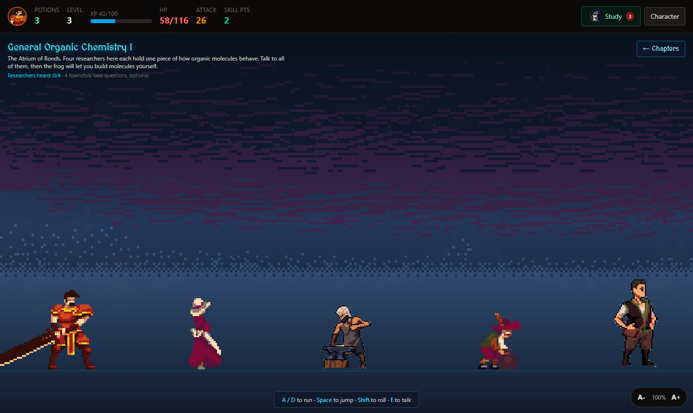
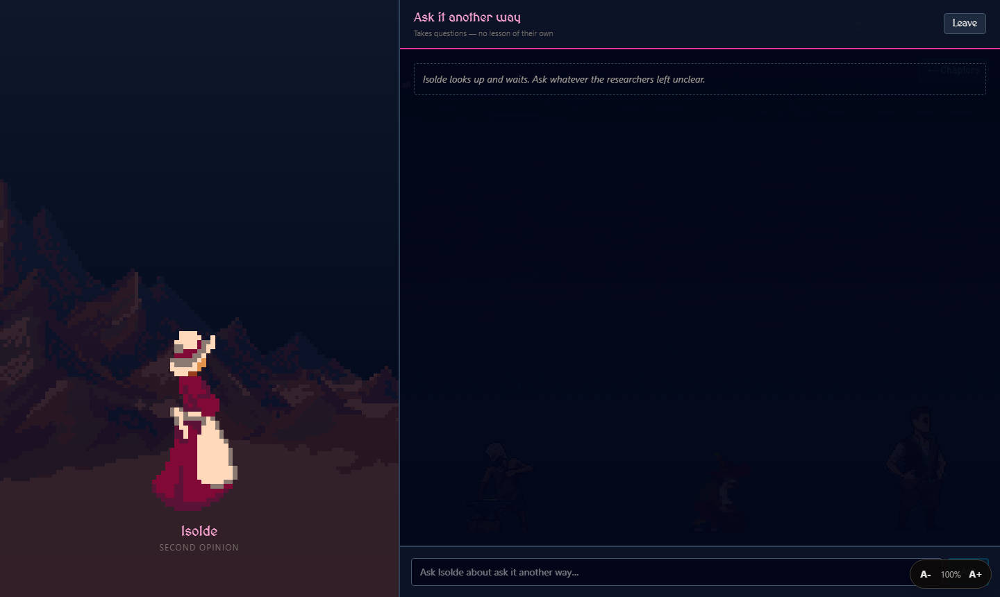
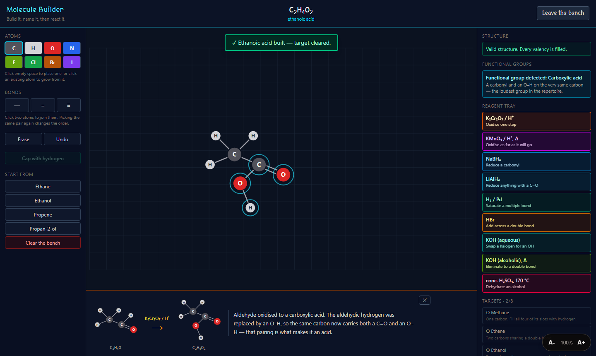
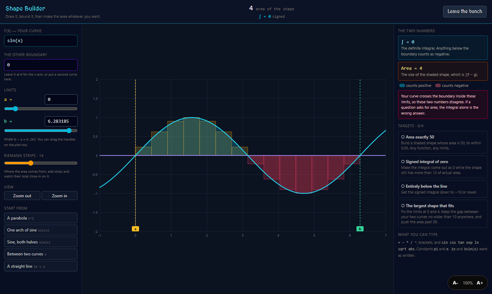
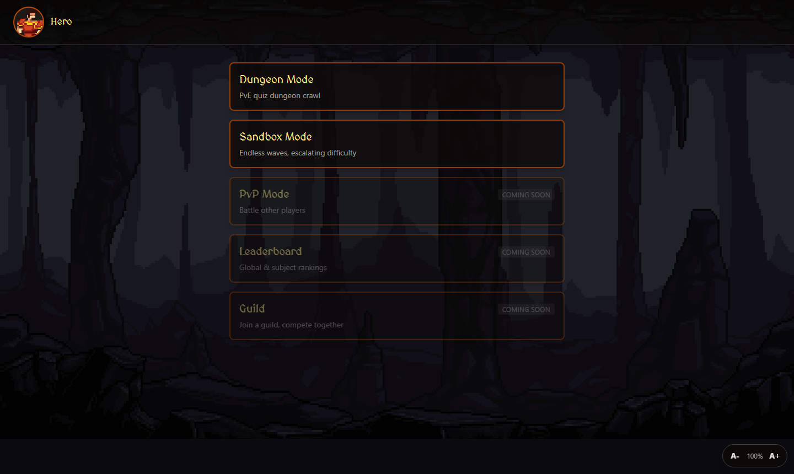
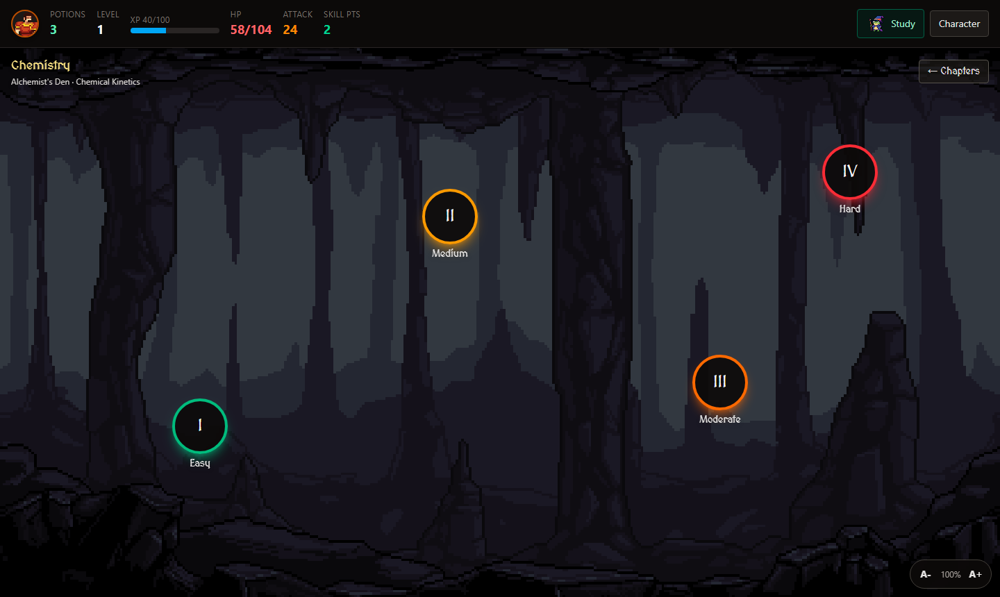

# Cognera

A turn-based dungeon crawler built on a real exam syllabus. Every attack is a question,
every wrong answer is logged and explained, and the RPG progression is driven by what the
student actually gets right.

The aim is a study tool people keep opening. Most gamified learning attaches points and
streaks to a flashcard app, which works until the novelty runs out. Here the game systems
are wired to the learning data: encounter difficulty comes from question difficulty, damage
comes from answer accuracy, and the post-run report is built from the mistakes made during
the run.



Built on a JEE-level bank of 942 questions across ten chapters of Mathematics, Physics and
Chemistry. Biology is scaffolded end to end and awaiting content. Nothing in the engine is
subject-specific: adding a subject means adding questions.

---

## Contents

- [The learning loop](#the-learning-loop)
- [Teaching, not just testing](#teaching-not-just-testing)
- [Concept simulations](#concept-simulations)
- [Game systems](#game-systems)
- [Architecture](#architecture)
- [Getting started](#getting-started)
- [Verification](#verification)

---

## The learning loop

### Difficulty means something

Each encounter is generated from a **difficulty budget**. The budget is filled by drawing
enemies whose individual difficulty values sum to it, so a budget of 4 might be one
difficulty-4 enemy or four difficulty-1 enemies. Every enemy has its own HP and damage and
pulls questions from its own difficulty band.

Difficulty is therefore felt as pacing. A Hard run is longer, asks harder questions, and
costs more HP per mistake. Player attack power scales with level, gear and skills, so
getting stronger visibly shortens fights against weaker material.

### Mistakes are the product

Most of the work happens after a wrong answer.

1. **On the mistake**, a worked solution is requested. The lookup is cache-first: bundled
   solutions, then the player's own cache, then the model. Solutions are keyed by question
   id, so a given question is solved once and reused every time it comes back.
2. **At the end of a run**, the Frog Wizard summarises it — which topics failed, what the
   underlying concept was, and where to go next.
3. **Across runs**, per-topic accuracy is tracked. A topic the player was failing (under
   50% over at least three attempts) that has since been answered right four times running
   is called out as an improvement, so progress is visible rather than assumed.
4. **The mistake log persists** and is grouped by topic, which turns a recurring weakness
   into a visible pattern instead of a series of bad sessions.



The Study desk is reachable from anywhere in the game. It holds progress by topic, the full
mistake history with worked solutions, and written notes for every chapter.

### Onboarding without a manual

A first-time player is walked through the real interface rather than a mock-up of it.
Everything is desaturated except the element being explained, which keeps its colour and
takes a highlight ring. The tour waits for the player to actually perform the action, and it
follows them across screens, so getting ahead of it does not strand it.



---

## Teaching, not just testing

A chapter is more than its question bank. Where a lesson has been written, the chapter
offers **Learn Content** alongside the dungeon: a side-scrolling hall where characters teach
the material before it gets used against you.



Four characters each teach one part of the chapter. The voices are a teaching device rather
than decoration, because the explanation that lands varies by student and the same material
is worth delivering four ways.

| Angle | Character |
| --- | --- |
| First principles, rebuilt from the foundation | a scholar who refuses shortcuts |
| Plain restatement with everyday analogies | a tutor who explains it a second way |
| Mnemonics, each with the reason it works | a collector of memory tricks |
| What the examiner is testing, and where marks go | a marker of thousands of papers |

Subject specialists stand alongside them where a chapter warrants it: a bondsmith who
explains valency in metalwork terms, a bard who treats functional groups as verses.



Once a character's scripted lesson ends, the panel becomes a live conversation. The student
can push back, ask for a different framing, or probe an edge case, and the reply comes back
in that character's voice with the chapter's concept context in the system prompt. Others in
the hall teach nothing at all and exist only to take questions, for when the scripted
explanation did not land.

The hall is gated: the simulation at the end does not unlock until every teaching character
has been heard.

---

## Concept simulations

Each chapter's hall ends in an interactive model of its concept, where the student builds
and manipulates the thing being studied instead of watching an animation of it.

The pattern is shared. A simulation is a domain module holding the rules of the subject plus
a React view that renders it, and a chapter opts in by naming it in its concept data. Two
are built so far; the framework is the point.

### Molecule Builder — organic chemistry



Place atoms from C, H, O, N and the halogens and join them with single, double or triple
bonds. Valency is enforced rather than merely displayed: a bond that would overspend an atom
is refused, and the refusal names the atom and the reason. Thirteen functional groups are
recognised from the molecular graph in IUPAC seniority order, so a carbonyl carrying an O–H
is reported as a carboxylic acid and not as an aldehyde plus an alcohol.

Nine reagents then transform the structure for real: the oxidation ladder, reduction,
addition, substitution, elimination. Each is drawn as *reactant → reagent → product* with an
explanation of what moved. A reagent with nothing to act on refuses and names the group it
was looking for, so a tertiary alcohol is turned away because its carbinol carbon has no
hydrogen left to strip.

### Shape Builder — definite integration



Type a function, choose the other boundary, and drag the limits while the region between
them is filled and measured live. The signed integral and the area of the shape are shown
together with positive and negative lobes coloured apart, because confusing the two is the
largest single source of lost marks in the chapter. A Riemann-strip overlay makes the
definition visible: add strips and watch their total close on the integral.

Four targets ask for specific geometry, including an area of exactly 50 and an integral that
vanishes while the shape stays large.

Both simulations are checked against known-correct results by scripts that run in Node
(see [Verification](#verification)).

---

## Game systems



**Modes.** Dungeon Mode by subject and chapter, or as mixed Total Revision across a whole
subject. Sandbox Mode runs escalating waves with loot that scales off waves survived. Learn
Content opens where a chapter has a lesson written.

**Dungeons.** Four difficulty tiers per chapter — Easy, Medium, Moderate, Hard — each with
its own encounter budget, question difficulty band and loot weighting. Hovering a tier shows
what it covers before you commit to it.



**Characters.** Five playable bodies (Adventurer, Fire Knight, Ground Monk, Leaf Ranger,
Wind Hashashin) with their own attack and HP multipliers, drawn at their true relative
proportions. Each has a skill school of its own, and the Ranger fires a projectile that
crosses the field so ranged attacks visibly connect. Characters can be swapped mid-battle on
a cooldown, which makes the roster a tactical choice rather than a set of skins.

**Combat.** Six actions: Wind Up (more damage on a correct answer, more punishment on a
wrong one), Dodge, Bag, Swap, an active skill spent from a Focus bar built by answer
streaks, and Retreat. Burn and stun effects tick between turns.

**Progression.** XP and levels, a passive skill tree bought with skill points, and seven
equipment slots across five rarity tiers rolled on a table weighted by dungeon tier. The
Adventurer supports modular armour layers drawn over the base sprite and tinted by rarity.

**Accessibility.** Font size is adjustable from every screen and persists between sessions.

**Offline first.** The whole game runs with no network and no account. Bundled worked
solutions and hand-written chapter notes cover the study path; the model fills gaps, and its
answers are cached the moment they arrive.

---

## Architecture

```
src/
  components/   React views: screens, HUD, sprite renderer, simulations
  game/         Domain logic — no React, no I/O
  data/         Questions, enemies, skills, concepts, solutions, study notes
  store/        Zustand stores (game state, UI preferences)
  services/     SaveService interface + localStorage implementation
scripts/        Python asset pipelines, TypeScript verification suites
```

`src/game/` holds no React and performs no I/O. Combat maths, loot rolls, mastery tracking,
the chemistry graph and the calculus engine are plain functions over plain data, which is
what makes them runnable from Node without a browser.

| Module | Responsibility |
| --- | --- |
| `game/combat.ts` | Encounter generation, damage, Focus, XP |
| `game/mastery.ts` | Per-topic accuracy and improvement detection |
| `game/solutions.ts` | Cache-first solution lookup with in-flight de-duplication |
| `game/molecules.ts` | Molecular graph, valency, formula, group recognition, naming |
| `game/reagents.ts` | Reagents as graph transformations, with explanations |
| `game/calculus.ts` | Tokeniser, parser, Simpson integration, area analysis |
| `game/characters.ts` | Character definitions and animation resolution |
| `components/Sprite.tsx` | Content-box sprite renderer |

### Sprite rendering

The art comes from several packs with different frame sizes and inconsistent anchoring
inside those frames. Rendering by frame gives sprites that jump and resize when they change
animation, and large sprites that sit mostly outside their container.

`Sprite.tsx` uses a measured **content box** as the element's box instead, so a sprite is
scaled and aligned by its drawn pixels rather than by its frame. Every animation of a
character shares one box, so switching animation never moves the character. Pixels may
deliberately overflow the box — a sword swing, an impact effect — which is why sprite layers
are `pointer-events: none`. The boxes are measured by the Python pipelines in `scripts/`,
which slice the source packs into strips and print the geometry the renderer needs.

### Expression parsing

The Shape Builder accepts typed functions, so it has to turn text into a curve. It uses a
tokeniser and a recursive-descent parser compiled to a closure rather than `eval` or
`new Function`. Bad input returns a message pointing at the offending character instead of
throwing, and no user-supplied string is ever executed. Implicit multiplication (`2x`,
`3sin(x)`, `x(x+1)`) is accepted because that is how students write it, and unary minus binds
looser than exponentiation so `-x^2` evaluates as `-(x^2)`.

### AI integration

Worked solutions and NPC conversation go through Groq's OpenAI-compatible API. The key is
read in the Node process by Vite middleware (`/api/solve`, `/api/chat`) and never reaches the
browser. Prompts live in `src/game/solutionPrompt.ts`, so moving the same request to a
serverless function later keeps behaviour identical.

### Persistence

Progress is written to `localStorage` behind a `SaveService` interface (`load` / `save` /
`reset`). Moving to server-backed accounts is an implementation of that interface rather than
a rewrite of game logic.

---

## Getting started

```bash
npm install
npm run dev
```

Runs at `http://localhost:5173`. No configuration is needed to play.

For the AI tutor and NPC conversation, create `.env.local`:

```
GROQ_API_KEY=your-key-here
```

The variable has no `VITE_` prefix on purpose: Vite inlines `VITE_`-prefixed variables into
the browser bundle, which would publish the key. `.env.local` is gitignored.

### Scripts

| Command | Purpose |
| --- | --- |
| `npm run dev` | Development server with HMR |
| `npm run build` | Type-check and produce a production build |
| `npm run preview` | Serve the production build |
| `npm run lint` | Oxlint |
| `npm run check:chemistry` | Verify the Molecule Builder's chemistry |
| `npm run check:calculus` | Verify the Shape Builder's mathematics |

The root `tsconfig.json` is a project-references stub, so `tsc --noEmit` is a no-op here.
`tsc -b`, which `npm run build` runs, is what actually type-checks.

### Asset pipelines

Source art is not tracked; only the sliced output under `public/sprites` is. To rebuild it
from the original packs:

```bash
python scripts/build_characters.py   # character strips + anchor boxes
python scripts/build_npcs.py         # NPC strips from labelled contact sheets
```

---

## Verification

The simulations teach real subject matter, so their output is checked rather than assumed.
Both suites run in Node with no browser and exit non-zero on failure.

**`npm run check:chemistry`** — 30 checks over structure building, IUPAC naming, valency
refusal, and every reagent against the product a textbook gives. The oxidation ladder is
walked end to end (ethanol → ethanal → ethanoic acid), NaBH₄ is confirmed to refuse a
carboxylic acid while LiAlH₄ reduces it, Markovnikov addition is checked to give
2-bromopropane from propene, and aqueous versus alcoholic KOH are checked to diverge into
substitution and elimination.

**`npm run check:calculus`** — 51 checks over operator precedence, implicit multiplication,
clean failure on malformed input, and numeric integration against integrals whose exact
values are known. Signed integral and area are checked to agree where the curve stays one
side of its boundary and to differ correctly where it crosses.

---

## Tech stack

React 19, TypeScript, Vite, Tailwind CSS v4, Zustand, Oxlint.

Rendering is layered DOM and CSS over sprite sheets rather than a canvas engine. The core
loop is turn-based, so a full game engine would add build complexity without buying anything
the interface needs.

---

## Roadmap

- Learn Content and simulations for the remaining chapters
- Server-backed accounts and cross-device progress behind the existing `SaveService`
- Realtime PvP: action combat, and a rapid-fire quiz mode on a shared timer
- Guilds, weekly guild competitions, and per-subject leaderboards
